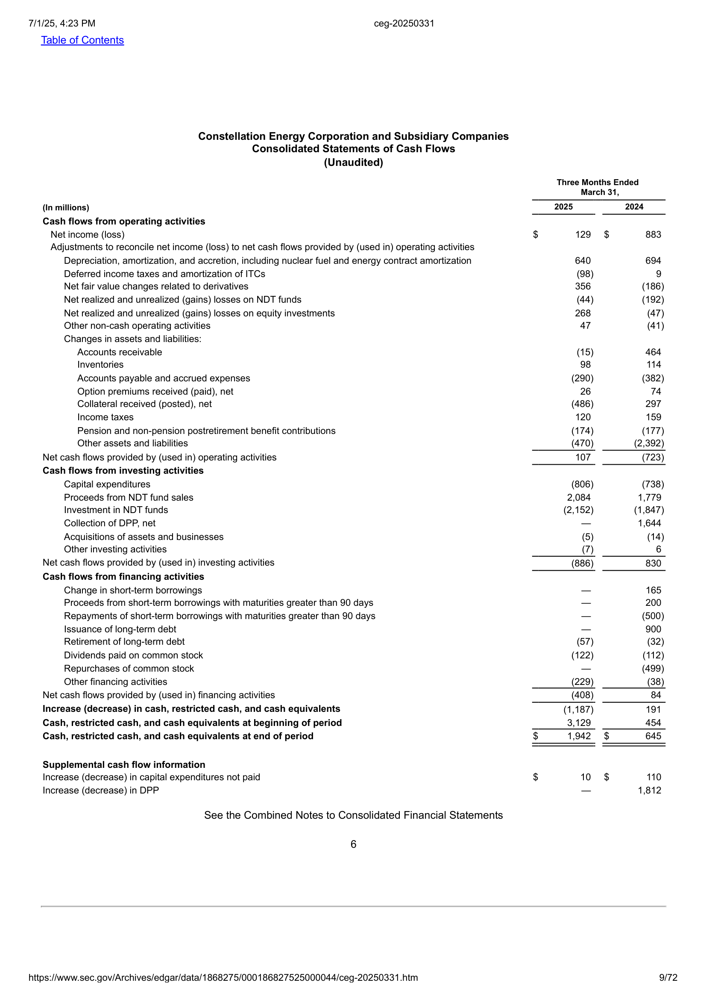

# 🧾 AWS SEC Document Processing with Multimodal AI

Ein praktisches End-to-End Machine-Learning-Projekt zur strukturierten Extraktion von Finanztabellen aus PDF-Berichten börsennotierter Unternehmen – mit LLM-Feintuning, Amazon SageMaker HyperPod und multimodaler Modellverarbeitung.

---

## 📸 Beispiel

> Extrahiere aus folgendem PDF-Finanzbericht automatisch den Inhalt einer Tabelle:
>
> 

---

## 🧰 Technologien

| Komponente              | Beschreibung |
|------------------------|--------------|
| **AWS SageMaker HyperPod** | Verteilter GPU-Cluster zum Feintuning großer Vision-Language-Modelle |
| **LLaMA-Factory**      | Open-Source-Framework zum Feintuning von LLMs |
| **Qwen2-VL-7B-Instruct** | Vision Language Model mit HTML-Ausgabe |
| **S3, IAM, CLI**       | Infrastruktur für Daten und Sicherheit |
| **Python, VSCode**     | Lokale Entwicklungsumgebung |

---

## 📂 Ordnerstruktur

.
├── data
│ ├── raw_pdfs/ # Originale Finanzberichte (PDF)
│ ├── preprocessed/ # Bilder (.png) extrahierter Seiten
│ └── html_tables/ # HTML Ground Truth pro Seite
├── scripts/
│ ├── docs_to_images.py # PDF -> PNG Konvertierung
│ ├── html_to_json.py # HTML-Tabellen in JSON exportieren
│ └── upload_to_s3.py # Daten in S3 hochladen
├── config/
│ ├── cluster-config.json # Cluster-Provisionierung
│ └── replacements.txt # Anonymisierungshilfe für Git
├── lifecycle.sh # Setup-Skript für SageMaker-Instanz
├── README.md
└── .gitignore


---

## ▶️ Projekt ausführen

### 1. Setup lokal:

```bash
git clone https://github.com/JedamzikFlorian/awssecdocumentsprocessing
cd awssecdocumentsprocessing
python -m venv venv
.\venv\Scripts\activate
pip install -r requirements.txt


### 2. Pdf zu Foto verarbeiten
python scripts/docs_to_images.py "data/raw_pdfs/DATEI.pdf" "data/preprocessed/ZIELORDNER"


### 3. HTML-Tabelle erstellen (manuell)

→ Datei speichern unter data/html_tables/page_XX.html


### 4. JSON erzeugen
python scripts/html_to_json.py


### 5. Daten in S3 hochladen
python scripts/upload_to_s3.py


### 6. Weiterentwicklung

 Unterstützung für automatische HTML-Annotationen
 Finetuning mit LLaMA-Factory
 Modell-Deployment via vLLM + API Gateway